<div align="center">
  <br />
  <p>
    <a href="https://finsim.com"></a>
  </p>
  <br />
  <p>
    <a href="https://finsim.com"></a>
    <a href="#"></a>
    <a href="#"></a>
  </p>

  <h1 align="center">FinSim: AI-Powered Trading Simulator</h1>
  <p align="center">
    Your personal AI trading laboratory. Backtest strategies, practice with paper money, and get AI-driven insights before you risk a single dollar.
    <br />
    <br />
    <a href="/about">About the Project</a>
    ·
    <a href="https://github.com/your-repo/issues">Report Bug</a>
    ·
    <a href="https://github.com/your-repo/issues">Request Feature</a>
  </p>
</div>

---

<div align="center">

**FinSim is your AI-powered sandbox for the stock market.** We provide the tools of a professional trading desk in an intuitive, educational, and risk-free environment.
Our mission is to democratize algorithmic trading and empower the next generation of investors.


*A preview of the FinSim dashboard, your mission control for trading.*

</div>

---

## 🚀 Key Features

FinSim is packed with features designed to take you from trading idea to a fully-tested strategy.

| Icon | Feature                  | Description                                                                                                                     | Page Link        |
| :--: | -------------------------- | ------------------------------------------------------------------------------------------------------------------------------- | ---------------- |
| 📊   | **Strategy Backtesting**   | Test your trading ideas against historical data to see how they would have performed, with AI-driven suggestions for improvement. | [/backtesting](/backtesting)     |
| ✍️   | **Paper Trading**          | Practice trading with virtual funds in a risk-free, simulated market environment to hone your skills.                           | [/paper-trading](/paper-trading) |
| 📰   | **Sentiment Analysis**     | Gauge market mood by analyzing news headlines and social media sentiment for various stocks.                                    | [/sentiment](/sentiment)         |
| 🤖   | **AI-Driven Signals**      | Receive actionable buy, sell, or hold signals generated by our advanced AI models, with explanations for every decision.         | [/ai-signals](/ai-signals)       |
| 🏛️   | **AI-Powered Historical Data** | Let our AI find relevant historical data based on market sentiment, perfect for testing strategies in specific conditions.      | [/historical-data](/historical-data) |
| ✨   | **Explainable AI (XAI)**   | We don't just give you a signal; we tell you *why* the AI made that decision, helping you build trust and learn.             | [/ai-signals](/ai-signals)       |
| 📈   | **Real-time Analytics**    | Visualize backtesting results with metrics such as Simulated ROI, Portfolio Value graph, Win Rate, and Max Drawdown.          | [/dashboard](/dashboard)         |

---

## ⚙️ How It Works: A Trader's Workflow

Our platform is designed to guide you through the entire process of developing and validating a trading strategy.

```mermaid
graph TD
    A[💡 Idea: 'I think Apple stock goes up when tech news is positive'] --> B{1. Get Data};
    B --> C[Fetch historical price data for AAPL on days with positive news sentiment using the <strong>Historical Data</strong> page];
    C --> D{2. Backtest};
    D --> E[Use the <strong>Backtesting</strong> engine to test a simple 'buy on positive news' strategy];
    E --> F{3. Analyze & Refine};
    F --> G[Review results: low profit. The AI suggests adding a 'Moving Average' indicator to avoid buying at peaks];
    G --> H{4. Paper Trade};
    H --> I[Implement the refined strategy in the <strong>Paper Trading</strong> environment to monitor its performance in a live, simulated market];
    I --> J[🎉 Success!];

    style A fill:#F0F4F7,stroke:#3282b8,stroke-width:2px
    style J fill:#3FB7AC,stroke:#fff
```



---

## 🛠️ Technology Stack

FinSim is built with a modern, robust, and scalable tech stack to deliver a seamless user experience.

| Category      | Technology                                                                                                    |
| ------------- | ------------------------------------------------------------------------------------------------------------- |
| **Frontend**  |          |
| **Styling**   |                                                                |
| **AI/ML**     |                                       |
| **Backend**   |  (Authentication, Firestore, Hosting) |
| **APIs**      |                                                                                                     |

---

## 🏁 Getting Started

To get a local copy up and running, follow these simple steps.

### Prerequisites

You need to have Node.js and npm installed on your machine.
* npm
  ```sh
  npm install npm@latest -g
  ```

### Installation

1.  **Clone the repository:**
    ```sh
    git clone https://github.com/your-repo/finsim.git
    cd finsim
    ```
2.  **Install NPM packages:**
    ```sh
    npm install
    ```
3.  **Set up your environment variables:**
    Create a `.env` file in the root of your project and add your API keys:
    ```env
    # No keys required for the base application to run
    # Add Finnhub or other keys here if you extend the functionality
    ```
4.  **Run the development server:**
    ```sh
    npm run dev
    ```
    Open [http://localhost:9002](http://localhost:9002) to view it in the browser.

---

## 🤝 Meet the Team

FinSim was brought to life by a passionate team of developers and designers.

<table align="center">
  <tr>
    <td align="center">
      <a href="#">
        <br />
        <sub><b>Shiv Rastogi</b></sub>
      </a><br />
      <sub>CEO</sub>
    </td>
    <td align="center">
      <a href="#">
        <br />
        <sub><b>Nakul Limbani</b></sub>
      </a><br />
      <sub>Co-Founder</sub>
    </td>
    <td align="center">
      <a href="#">
        <br />
        <sub><b>Prakeerth Gollapati</b></sub>
      </a><br />
      <sub>CTO</sub>
    </td>
  </tr>
</table>

---

## 📄 License

Distributed under the MIT License. See `LICENSE` for more information.
